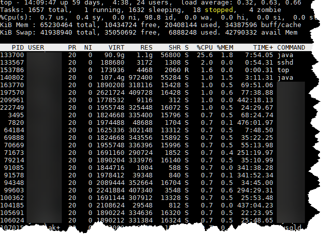

# Overview

In this Lab we will develop a simple program that was mentioned in
[OSTEP Chapter
5.6](http://pages.cs.wisc.edu/~remzi/OSTEP/cpu-api.pdf).Top has many
features which you can read about with the command **man top**, we
will be implementing a small subset of the features described in the
man page.



## Learning objectives

- Learn about processes on Linux
- Explore the /proc file system
- Explore strace to reverse engineer what a program is doing
- Use the C standard library to read from files
- Use structs and pointers

## The /proc file system

On Linux systems the _proc_ file system is a pseudo-filesystem which
provides an interface to kernel data structures. Read through the [man
page](http://man7.org/linux/man-pages/man5/proc.5.html) describing the
_proc_ file system to get a rough overview of what it contains.

For our purposes we will primarily be focused on the **/proc/[pid]**
directories which contain information about each running process. The
man page gives a very thorough description of the proc file
system. While it is certainly possible to derive our program just from
the documentation there is a faster way. Because Linux leveraged the
[everything is a
file](https://en.wikipedia.org/wiki/Everything_is_a_file) abstraction
we can quickly derive where all the correct information is by using a
small inline bash script!

We will pick the process with *pid 1*. The process with *pid 1* was
the first process that the kernel runs after booting. We can focus in
on a specific process with the command **top -p 1**. Note: that what is
show below will not match exactly with your system because this is a
snapshot from a live system.

```
$ top -pid 1
%Cpu(s):  0.6 us,  0.0 sy,  0.0 ni, 99.4 id,  0.0 wa,  0.0 hi,  0.0 si,  0.0 st
KiB Mem : 65577632 total, 50112804 free,  1912548 used, 13552280 buff/cache
KiB Swap: 32899068 total, 32899068 free,        0 used. 63149576 avail Mem

  PID USER      PR  NI    VIRT    RES    SHR S  %CPU %MEM     TIME+ COMMAND
    1 root      20   0  194076   7248   4232 S   0.0  0.0   1:55.22 systemd
```

Armed with the knowledge that we got from the top man page and running
the top program we can now write a small inline bash script to see
where all our data is located. NOTE: you should *not* run the script
below as root, you want to use a normal user account.

```
$ cd /proc/1
$ for f in `/bin/ls`
> do
> echo "Reading file $f"
> cat $f
> printf "\nPress Enter for next file\n"
> read
> done
...

Reading file status
Name:	systemd
Umask:	0000
State:	S (sleeping)
Tgid:	1
Ngid:	0
Pid:	1

...
```

You will iterate through all the files in the directory **/proc/1**
and will eventually see the contents of the *status* file. Don't worry
about any *access denied* messages when you iterate all the files that
it is normal. If you examine the contents of the **/proc/1/status**
file it seems that it has all the information that we need to write
our own mini top program! However, we still want to confirm what we
have found so lets use the strace program to actually look at what top
is doing. [Strace](https://en.wikipedia.org/wiki/Strace) is an amazing
tool that lets you trace all the system calls that a process is
making. We can run strace on top with the command strace top however
we want to capture all the output from the command to a file so we can
examine it at our leisure so we will use the command timeout to run
strace for only 5 seconds and redirect *stderr* to a file.

```
$timeout 5s strace top 2> straceout.txt
```

Once the command completes (after 5 seconds) we can open up the file
*straceout.txt* and take a look at what system calls top was
making. The file that was created may be very long. It just shows you
how many system calls a process makes to do even the most simple of
tasks! Take some time to look through the file and look up some of the
system calls.

Reading through the file we can make several deductions on what
we need to do in our program.

1. top uses the
   [alarm](http://man7.org/linux/man-pages/man2/alarm.2.html) system
   call. This is how top refreshes its view of the system.
2. top uses /proc/[pid]/stat to get the status information about the
   process *NOT* /proc/[pid]/status. Reading through the /proc man
   page tells us how to read in the stat file using the proper
   [scanf](http://man7.org/linux/man-pages/man3/scanf.3.html) format
   specifiers.

## Requirements

We now have enough information to write our own version of top. You
should design your application with a front and back end. The back end
is responsible for reading in all the information from /proc and
putting it into an appropriate data structure, you will implement this
in **lab.c**. The front end will be responsible for displaying the
data and will be implemented in **mytests.c**. There should be **NO**
calls to printf in the file **lab.c**. Your backend should not output
any data, it should only create the correct data structures and pass
the results to **mytests.c** which will print them to the console.

You must collect the following information on each process from the
/proc file system.

1. *pid* - The pid of every process
2. *comm* - The filename of the executable
3. *state* - The state of the process (Running, Sleeping, etc)
4. *utime* - The amount of time that the process has been scheduled in
   user mode
5. *stime* - The amount of time that the process has been schedule in
   kernel mode
6. *processor* - The CPU number last executed on.

Your program must accept the following command line inputs with the
specified behavior:

- **./mytests -p** When the user passes the *-p* switch your program will display the
  results in *pid* order to stdout and then exit
- **./mytests -c** When the user passes the *c* switch your program will display the
  results in *comm* order (lexicographic order) to stdout and then exit
- **./mytests -z** When the user passes the *z* switch your program will display the
  zombies to stdout and then exit
- **./mytests -d dir** When the user passes the *d* switch your
  program will start parsing dir instead of /proc. For example
  the command **./run.sh -d $HOME/test -p** will treat the directory
  **$HOME/test** as the **/proc** directory and show the results in
  *pid* order.
- **./mytests** When the user gives *no* command line arguments your program
  will just display the process in *pid* order and refresh the display
  every *5* seconds.

## Grading Rubric

All grading will be executed on onyx.boisestate.edu Submissions 
that fail to compile will not being graded.

- [30 pts] Instructor private test suite for **lab.c**
  - Score will reflect number of tests passed divided by the total number of tests
- [10 pts] Code quality for **lab.c**
  - [4 pts] Code is formatted correctly and follows a consistent style
  - [2 pts] Code is commented when necessary
  - [4 pts] There is more than just the main function in **mytests.c**
- [15 pts] Compiler warnings **ALL files**
  - Each compiler warning will result in a 3 point deduction.
  - You are not allowed to suppress warnings
  - You must build with the flags ```-Wall -Wextra -Wpointer-arith -Wstrict-prototypes -std=gnu89``` 
- [30 pts] Code coverage for **lab.c** (student authored).
  - As reported by **runcov.sh**
  - Grade will be calculated using the formula **min((%cov/80),1) * 30.** 
    - example: **runcov.sh** reports 50% coverage - min((50/80),1) * 30 = 18.75
    - example: **runcov.sh** reports 70% coverage - min((70/80),1) * 30 = 26.25
    - example: **runcov.sh** reports 80% coverage - min((80/80),1) * 30 = 30
    - example: **runcov.sh** reports 90% coverage - min((90/80),1) * 30 = 30
  - **lab.c** is the only file that is checked for code coverage
- [10 pts] Valgrind reports no memory leaks or read/write errors
  - As reported by **runval.sh**
  - This is a **PASS/FAIL** score. 1 read/write error or leaking 1
    byte will result in a zero for this section. There is no partial
    credit for this section.
- [5 pts] In the file lab.c you updated the header on lines 2,3, and 4

## Submission

You can make as many commits to your git repository as you want. When
I grade I will use the top commit as what you are submitting for
credit.

Pushing your code for grading
- git add lab.c
- git add mytests.c
- git commit -am "Finished the lab"
- git push

### AJ's Thoughts
- Question: what is the best way to throw and handle errors in C?
